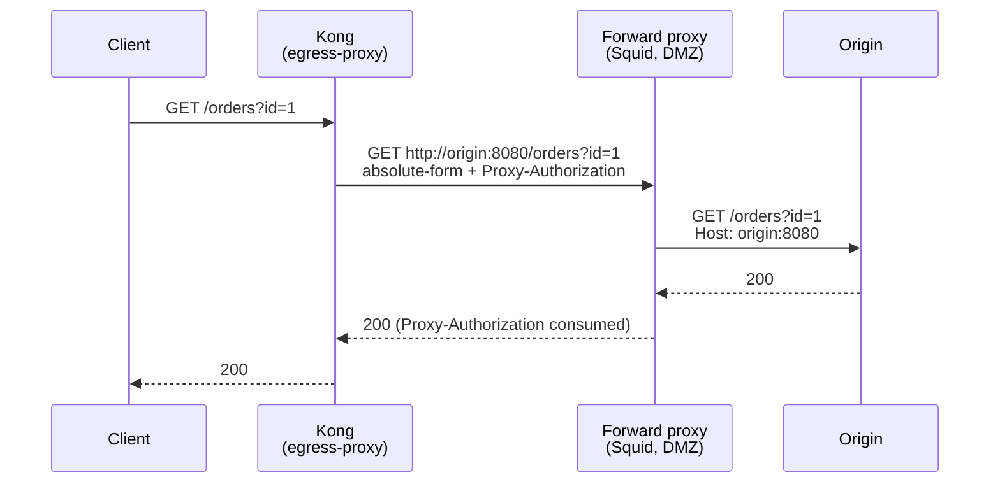

# kong-egress-proxy

[](https://github.com/davidgrldo/kong-egress-proxy/actions/workflows/test.yml)
[](https://konghq.com)
[](LICENSE)

**Route Kong's upstream traffic through a forward proxy (Squid, tinyproxy,
corporate DMZ proxies) — for Kong Gateway OSS 3.x.**



## Why

The "all egress must cross the DMZ proxy" topology is standard in banking
and regulated networks. Kong Enterprise ships a `forward-proxy` plugin for
it; Kong OSS has nothing, does not honor `http_proxy` env vars on the data
path, and the one community attempt
([tfabien/kong-forward-proxy](https://github.com/tfabien/kong-forward-proxy))
died in 2018 targeting Kong 0.x. This is the 3.x successor — named
`egress-proxy` so it never clashes with the Enterprise plugin name.

## Quick start

```yaml
plugins:
  - name: egress-proxy
    config:
      proxy_host: squid.dmz.internal
      proxy_port: 3128
      proxy_username: kong          # optional (Proxy-Authorization: Basic)
      proxy_password: "{vault://env/squid-password}"
      on_https: reject              # or bypass (see "Scope: http only")
```

Apply globally, per-service, or per-route. Serviceless routes are skipped
with a warning.

## How it works

A forward proxy expects the request line in **absolute-form**
(RFC 7230 §5.3.2): `GET http://origin/path HTTP/1.1` — that's how it knows
where to forward. The 2018 plugin skipped this and only worked with
specially configured proxies; standard Squid rejects origin-form on a
forward port.

nginx's own data path cannot produce that request line: Kong's template is
`proxy_pass $upstream_scheme://kong_upstream$upstream_uri`, and nginx
requires the URI part after the host to start with `/` — an absolute URI
in `ngx.var.upstream_uri` fails nginx's URL parsing outright
(`invalid port in upstream`). So, like the Enterprise `forward-proxy`,
this plugin sends the hop itself. In the access phase it:

1. builds the absolute-form URI (path + query) from the Service entity and
   the final upstream path (after `strip_path`, request-transformer, etc.
   — the plugin runs at `PRIORITY = 50`, near the end of the phase);
2. re-sends the request to the proxy with Kong's bundled `lua-resty-http`,
   hop-by-hop headers stripped;
3. sets `Host` to the origin authority (`host[:port]`) — it must match the
   URI authority, which the proxy treats as canonical and rewrites a
   mismatching `Host` from;
4. adds `Proxy-Authorization` when credentials are configured;
5. returns the proxy's response via `kong.response.exit`.

Trade-offs of owning the hop: the response is buffered (no streaming), and
a request body must fit in nginx's client body buffer to be forwarded
(oversized bodies get a clear `413`).

## Scope: http upstreams only — deliberately

A forward proxy carries **https** as a `CONNECT` tunnel with the TLS
handshake inside it. Kong's data path cannot speak that, and hand-rolling
TLS-inside-TLS in plugin Lua is fighting the platform. Two honest options
per plugin instance:

- `on_https: reject` (default) — https Services get a `503` with a clear
  log line, so a misconfiguration is loud, never silent.
- `on_https: bypass` — https Services connect **directly**, skipping the
  proxy (for topologies where the firewall allows direct 443 egress).

For https egress that *must* cross a proxy, use a transparent proxy
(Squid intercept + firewall redirect) or an egress gateway — not a Kong
plugin. Anything claiming otherwise is fighting the data path.

## Configuration

| Field | Type | Default | Description |
|-------|------|---------|-------------|
| `proxy_host` | string | *required* | Forward proxy hostname. |
| `proxy_port` | integer | *required* | Forward proxy port (e.g. 3128). |
| `proxy_username` | string | *(none)* | Basic credentials for the proxy hop. |
| `proxy_password` | string | *(none)* | Referenceable — supports `{vault://...}` so it never sits in plain config. Requires `proxy_username`. |
| `on_https` | string | `reject` | `reject` https Services with 503, or `bypass` the proxy for them. |

## Tests

Every behavior claimed here is asserted: **18 unit tests** (plain Lua 5.1,
kong/ngx mocked) and a **10-case e2e suite** against real Kong 3.9 + real
Squid. The e2e proves proxying by reading **Squid's access log** — not just
end-to-end success — including the negative case: bypassed https traffic
never appears in it. It also asserts the origin never sees
`Proxy-Authorization` (the proxy hop consumes it).

```sh
# unit
LUA_PATH="./?.lua;./plugins/egress-proxy/?.lua;;" lua spec/run.lua

# e2e (docker + jq); KEEP=1 leaves the stack up to play with
e2e/run.sh
```

## Installation

```sh
cd plugins/egress-proxy && luarocks make kong-egress-proxy-0.1.0-1.rockspec
export KONG_PLUGINS=bundled,egress-proxy
```

## Roadmap

- [ ] Per-host no-proxy list (bypass the proxy for internal domains)
- [ ] `X-Forwarded-*` handling options for strict proxies
- [ ] `KongPlugin` CRD examples for Kong Ingress Controller

## License

Apache-2.0.
